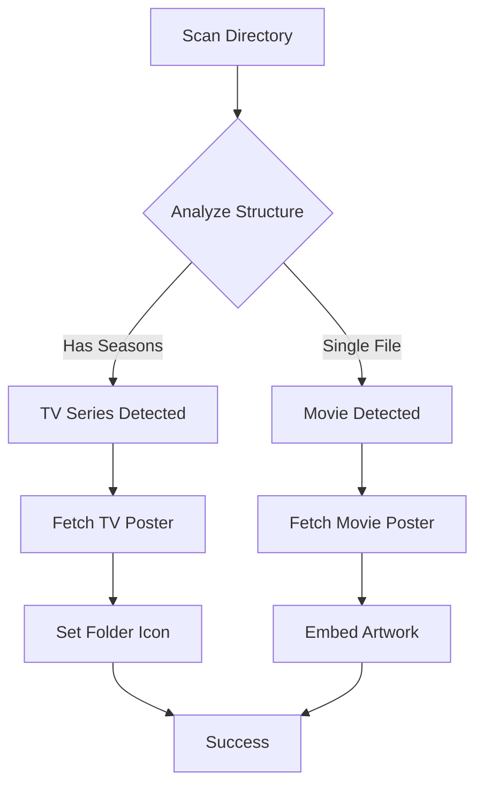

# Smart Media Icon System

[](https://opensource.org/licenses/MIT)
[](https://www.python.org/downloads/)
[](https://www.microsoft.com/windows)

A professional Windows desktop utility that automatically sets custom icons for TV series folders and embeds artwork in movie files using intelligent media type detection.

## 🌟 Features

### 🧠 Smart Detection
- **Automatic Media Type Detection**: Distinguishes between TV series and movies
- **Intelligent Folder Analysis**: Recognizes season/episode structures
- **Multi-Format Support**: Handles various video file formats

### 🎨 Dual Icon Strategy
- **📺 TV Series**: Custom folder icons using Windows `desktop.ini` system
- **🎬 Movies**: Embedded artwork directly in video files using FFmpeg
- **🖼️ High-Quality Icons**: Converts posters to proper `.ico` format

### 🌐 Multi-API Integration
- **TMDB** (The Movie Database) - Primary source for movies and TV shows
- **OMDb** (Open Movie Database) - Backup for movies and TV shows
- **TVmaze** - Specialized TV show database
- **AniList** - Anime and manga database
- **Smart Fallbacks** - Automatic failover between APIs

### 🚀 Professional Benefits
- **Windows Explorer**: TV series folders display custom poster icons
- **Media Players**: Movies show embedded artwork (VLC, Windows Media Player, etc.)
- **File Properties**: Right-click movie files show poster thumbnails
- **Media Centers**: Plex, Jellyfin, Emby automatically use embedded artwork
- **Visual Organization**: Instant visual identification of media content

## 📸 Screenshots

### Before
```
📁 Media/
├── 📁 GameOfThrones/          # Generic folder icon
│   ├── 📁 Season1/
│   └── 📁 Season2/
└── 📁 Inception/              # Generic folder icon
    └── 🎥 Inception.mp4       # No embedded artwork
```

### After
```
📁 Media/
├── 🖼️ GameOfThrones/           # ✅ Custom poster folder icon
│   ├── 📁 Season1/
│   ├── 📁 Season2/
│   ├── 📄 desktop.ini          # ✅ Windows icon config
│   ├── 🎨 folder.ico           # ✅ Poster in .ico format
│   └── 🖼️ poster.jpg           # ✅ Original poster
└── 📁 Inception/               # Standard folder
    ├── 🎥 Inception.mp4        # ✅ Contains embedded poster artwork
    ├── 🔄 Inception.mp4.backup # ✅ Original backup
    └── 🖼️ poster.jpg           # ✅ Original poster
```

## 🛠️ Installation

### Prerequisites
- **Windows 10+** (Windows 11 recommended)
- **Python 3.8+** 
- **FFmpeg** (for movie artwork embedding)

### Quick Install

1. **Install FFmpeg**
   ```bash
   # Using winget (recommended)
   winget install "FFmpeg (Essentials Build)"
   ```

2. **Install Smart Media Icon System**
   ```bash
   # Clone the repository
   git clone https://github.com/yourusername/smart-media-icon.git
   cd smart-media-icon
   
   # Install dependencies
   pip install -r requirements.txt
   
   # Optional: Install as package
   pip install -e .
   ```

3. **Quick Test**
   ```bash
   python main.py --help
   ```

## ⚡ Quick Start

### Basic Usage
```bash
# Process current directory
python main.py

# Process specific directory
python main.py "C:\Media"

# Verbose output
python main.py "D:\Movies" --verbose

# Custom configuration
python main.py "E:\TV" --config myconfig.json
```

### Configuration
Create `config.json` (optional - system works with defaults):
```json
{
    "TMDB_API_KEY": "your_tmdb_api_key_here",
    "OMDB_API_KEY": "your_omdb_api_key_here",
    "TVMAZE_API_KEY": "your_tvmaze_api_key_here",
    "ANILIST_API_KEY": "your_anilist_api_key_here",
    "USE_CACHE": true,
    "USE_MOCK_API": false
}
```

## 🎯 How It Works

### 1. Smart Detection Algorithm
```python
# Series Detection Logic
if folder_contains_season_subdirectories:
    media_type = "series"  → Apply folder icon strategy
    
# Movie Detection Logic  
elif folder_contains_single_media_file:
    media_type = "movie"   → Apply FFmpeg artwork embedding
```

### 2. Processing Flow


### 3. Icon Strategies

#### TV Series (Folder Icons)
- Downloads poster from API
- Converts to `.ico` format
- Creates `desktop.ini` configuration
- Sets Windows folder attributes
- **Result**: Custom folder icon in Windows Explorer

#### Movies (Embedded Artwork)
- Downloads movie poster
- Uses FFmpeg to embed as video metadata
- Creates backup of original file
- **Result**: Media players show embedded poster

## 📊 Supported Formats

### Video Files
- `.mp4`, `.mkv`, `.avi`, `.mov`, `.wmv`
- `.flv`, `.webm`, `.m4v`, `.mpg`, `.mpeg`
- `.m2v`, `.3gp`, `.ts`, `.mts`, `.vob`

### Image Formats
- `.jpg`, `.jpeg`, `.png`, `.bmp`, `.gif`
- Automatic conversion to `.ico` for Windows

## 🔧 Advanced Usage

### Python API
```python
from smart_media_icon import SmartIconSetter, Config

# Initialize with config
config = Config('config.json')
setter = SmartIconSetter(config)

# Process directory
success_count = setter.process_media_collection('/path/to/media')
print(f"Processed {success_count} items successfully")
```

### Custom Configuration
```python
from smart_media_icon.utils import Config

config = Config()
config.USE_MOCK_API = True  # For testing
config.USE_CACHE = False    # Disable caching

setter = SmartIconSetter(config)
```

## 🧪 Testing

### Run Examples
```bash
cd examples
python usage_examples.py
```

### Manual Testing
```bash
# Create test structure
mkdir test_media
mkdir "test_media/GameOfThrones"
mkdir "test_media/GameOfThrones/Season1"
echo "test" > "test_media/GameOfThrones/Season1/episode01.mp4"

# Process test directory
python main.py test_media --verbose
```

## 📁 Project Structure

```
smart-media-icon/
├── 📁 src/smart_media_icon/       # Core package
│   ├── 📁 core/                   # Core functionality
│   │   ├── icon_setter.py         # Main orchestration
│   │   ├── ffmpeg_handler.py      # FFmpeg operations
│   │   └── windows_icons.py       # Windows folder icons
│   ├── 📁 apis/                   # API integrations
│   │   └── media_api.py           # Multi-API poster fetching
│   ├── 📁 utils/                  # Utilities
│   │   └── config.py              # Configuration management
│   └── cli.py                     # Command line interface
├── 📁 docs/                       # Documentation
│   └── API.md                     # API reference
├── 📁 examples/                   # Usage examples
│   └── usage_examples.py          # Example scripts
├── main.py                        # Main entry point
├── setup.py                       # Package setup
├── requirements.txt               # Dependencies
├── config.json                    # Configuration file
└── README.md                      # This file
```

## 🔍 Troubleshooting

### FFmpeg Issues
```bash
# Verify FFmpeg installation
ffmpeg -version

# Install if missing
winget install "FFmpeg (Essentials Build)"
```

### Folder Icons Not Showing
1. **Restart Windows Explorer**: `Ctrl+Shift+Esc` → Restart "Windows Explorer"
2. **Check Attributes**: Folder should have System + Read-only attributes
3. **Verify Files**: Check `desktop.ini` exists with Hidden + System attributes

### API Rate Limits
- System includes intelligent rate limiting and caching
- Mock API provides fallback when real APIs are unavailable
- Cache prevents repeated API calls for same content

### Permission Issues
- Run as Administrator if accessing system directories
- Ensure write permissions for target directories
- Check antivirus software isn't blocking file operations

## 🤝 Contributing

### Development Setup
```bash
# Clone repository
git clone https://github.com/yourusername/smart-media-icon.git
cd smart-media-icon

# Install in development mode
pip install -e .[dev]

# Run tests
pytest

# Format code
black src/
```

### Contribution Guidelines
1. Fork the repository
2. Create a feature branch
3. Write tests for new functionality
4. Ensure code follows style guidelines
5. Submit a pull request

## 📄 License

This project is licensed under the MIT License - see the [LICENSE](LICENSE) file for details.

## 🙏 Acknowledgments

- **[TMDB](https://www.themoviedb.org/)** - Comprehensive movie and TV database
- **[FFmpeg](https://ffmpeg.org/)** - Powerful multimedia framework
- **[Pillow](https://pillow.readthedocs.io/)** - Image processing library
- **Microsoft** - Windows API and desktop integration

## 📞 Support

- **Documentation**: [API Reference](docs/API.md)
- **Examples**: [Usage Examples](examples/usage_examples.py)
- **Issues**: [GitHub Issues](https://github.com/yourusername/smart-media-icon/issues)
- **Discussions**: [GitHub Discussions](https://github.com/yourusername/smart-media-icon/discussions)

---

**Made with ❤️ for the media enthusiast community**
